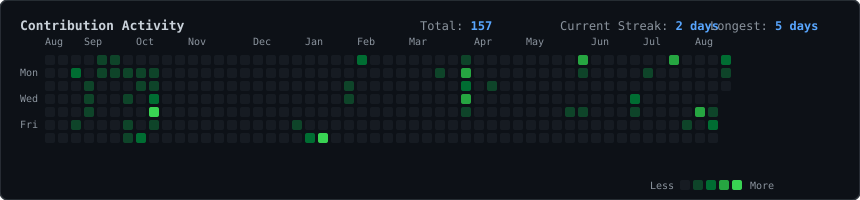

<div align="center">

# `nilesh@github:~$ whoami`

### `Computer Science Engineer • Developer • AI/ML Enthusiast`

<br>



<br><br>

<h3><code>nilesh@github:~$ ./profile.sh</code></h3>

<table>
<tr>
<td valign="top" width="42%">


</td>

<td valign="top" width="58%">


</td>
</tr>
</table>

<br>

<h3><code>nilesh@github:~$ echo "building → learning → creating"</code></h3>

</div>

---

## `~/about`

```text
Name        : Nilesh Swain
Role        : Computer Science Engineering Student
Focus       : Software Development • AI/ML • Problem Solving
Mindset     : Learn → Build → Break → Improve
```

I'm a Computer Science Engineering student who enjoys turning ideas into practical software.

My interests span **full-stack development, artificial intelligence, machine learning, backend systems, and competitive programming**.

I believe the best way to learn technology is to build with it.

---

## `~/tech-stack`

### Languages

<p>


</p>

### Frontend

<p>


</p>

### Backend & Database

<p>


</p>

### AI / ML

<p>


</p>

---

## `~/projects`

### `01` — AI & Machine Learning

Projects involving **computer vision, deep learning, classification, tracking, and intelligent systems**.

### `02` — Full-Stack Applications

Modern web applications built with technologies such as **React, Node.js, Express, MongoDB, MySQL, and PHP**.

### `03` — Developer Platforms

Building tools and platforms designed to help students **learn, practice, compete, and grow as developers**.

### `04` — Experimental Projects

Hackathon projects, prototypes, research ideas, automation tools, and experiments.

<br>

> `There is always another idea waiting to be built.`

---

## `~/current-focus`

```text
[████████████████████░░] 90%  Full-Stack Development
[██████████████████░░░░] 80%  Data Structures & Algorithms
[████████████████░░░░░░] 75%  Artificial Intelligence
[███████████████░░░░░░░] 70%  Machine Learning
[████████████░░░░░░░░░░] 60%  System Design
```

Currently focused on strengthening fundamentals, building production-quality projects, and preparing for challenging software engineering opportunities.

---

## `~/github-stats`

<div align="center">


</div>

---

## `~/connect`

<div align="center">

<a href="https://github.com/">

</a>

<a href="https://www.linkedin.com/">

</a>

<a href="mailto:your-email@example.com">

</a>

</div>

---

<div align="center">

```text
┌──────────────────────────────────────────────┐
│                                              │
│   "Code is not just written.                │
│    It is designed, tested, and evolved."    │
│                                              │
└──────────────────────────────────────────────┘
```

### `nilesh@github:~$ exit`

`Thanks for visiting. Keep building. 🚀`

</div>
